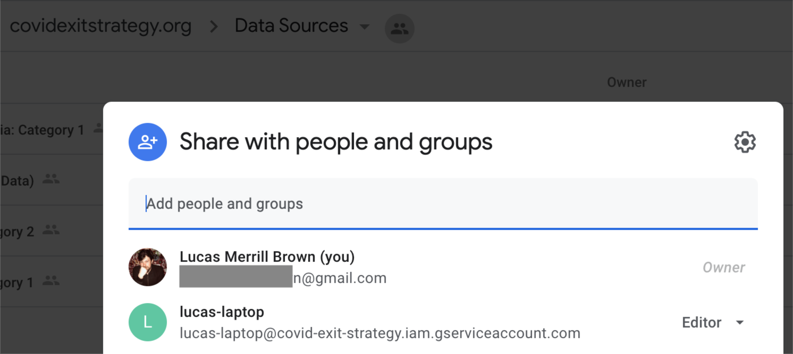

# Covid Exit Strategy

This repository includes the source code for generating data for [covidexitstrategy.org](https://www.covidexitstrategy.org/).

There are functions for extracting the data from a variety of sources, transforming and enriching it, and then finally
loading it into a Google Sheet which serves as the database backing the website.

The documents for this project are kept in [Google Drive](https://drive.google.com/drive/u/1/folders/1NRgsCay6XvmZ8Qsj53aK0IFvTfN-CFwD).

The data for the website currently comes from [this workbook](https://docs.google.com/spreadsheets/d/1ZhwP0GZTz50myibSaWsMXOVQKx9DQaJO4rN1i58Rrjc/edit#gid=712897421),
which also includes tabs that Ryan refreshes on a regular basis with updated copied data.

The meaning of the CDC criteria ([defined here](https://drive.google.com/file/d/1zWLHPIz6UWiwrI5tYz1roy1t9PpqE0dj/view?usp=sharing)) are spelled out in our interpretation in [this workbook](https://docs.google.com/spreadsheets/u/1/d/1q9yZaQ1_qwEecvYknS1sZsRbD6eDY7il_uIX2dInbr0/edit?usp=drive_web&ouid=109155667631110887569).

# Posting data through these scripts

To successfully update the data in the spreadsheet, you'll need to do the following.

First, [create a Google Service Account](https://cloud.google.com/iam/docs/creating-managing-service-accounts). It
doesn't matter what project that service account is in, so you can create a new personal project. Create a keyfile for
that Google service account and save it as `service-account-key.json` in the root level of this repository.

Next, add the "email address" of your service account to have permissions to the [Data Sources](https://drive.google.com/drive/u/1/folders/15j1iyyJtJ8BmK3y-HO6cLp-7R7nAoSml)
folder of the Google Drive through the user interface which looks like this:

Finally, make sure that the Google Sheets and Drive APIs are enabled it your service account's project. Go to these links:
https://console.developers.google.com/apis/library/sheets.googleapis.com?project=<project_id> and
https://console.developers.google.com/apis/api/drive.googleapis.com/overview?project=<project_id>, replacing `<project_id>`
with your project ID, to enable the Google Sheets and Drive APIs.

As you start your work you may choose to set your service account permissions for read-only until you're ready to post
data.

Your service account should now be picked up automatically by these scripts with the appropriate level of access.

# Configuring pre-commit hooks

To promote consistent code style and quality, we use git pre-commit hooks to automatically lint and reformat our
code before every commit we make to the codebase. Pre-commit hooks are defined in
[`.pre-commit-config.yaml`](../.pre-commit-config.yaml).

1.  First, install [`pre-commit`](https://pre-commit.com/) globally:

        $ brew install pre-commit

2.  Run `pre-commit install` to install the specific git hooks used in this repository.

Now, any time you commit code to the repository, the hooks will run on all modified files automatically. If you wish,
you can force a re-run on all files with `pre-commit run --all-files`.
